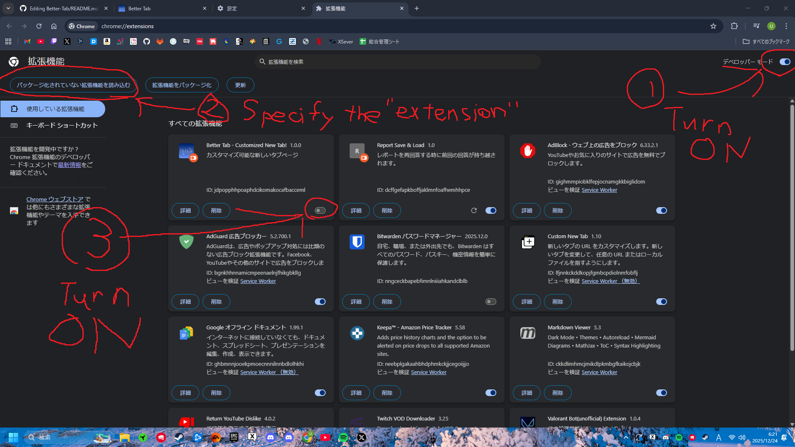
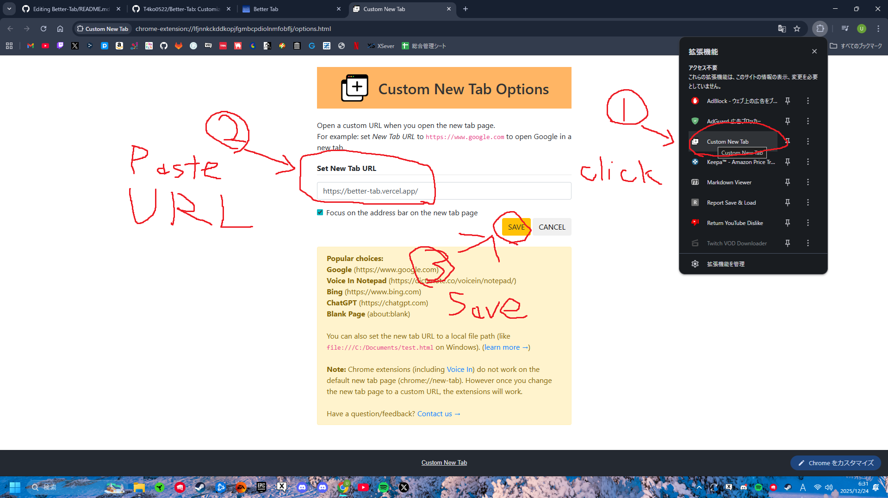

<h1>Better Tab</h1>

Customizable new tab page.  
A modern and easy-to-use new tab page that combines a clock, weather, calendar, and trending articles into one page.

## How to Use

#### Extension
1. Download the zip file from Release
2. Extract the downloaded zip file
3. Open chrome://extensions/
4. Enable Developer Mode
5. Click Load Unpacked Extension
6. Select the extension from the extracted zip file

#### Or
1. Install the [Custom New Tab](https://chromewebstore.google.com/detail/custom-new-tab/lfjnnkckddkopjfgmbcpdiolnmfobflj?hl=ja&utm_source=ext_sidebar) extension
2. Open Custom New Tab Settings
3. Paste the URL and save it

### How to Use
1. **Setting the Background Image**
- Click the Settings icon
- Select the "Background" tab
- Upload an image or enter a URL
- Crop the image as needed

2. **Show/Hide Widgets**
- Click the Settings icon
- Select the "Display Settings" tab
- Toggle the visibility of each widget

3. **Search**
- Enter a search term in the search bar in the center of the page
- Press Enter or click the search button

## 🛠️ Technology Stack

- **Framework**: [Next.js](https://nextjs.org/) 16
- **UI Library**: [React](https://react.dev/) 19
- **Language**: [TypeScript](https://www.typescriptlang.org/)
- **Styling**: [Tailwind CSS](https://tailwindcss.com/) 4
- **UI Components**: [Radix UI](https://www.radix-ui.com/)
- **Data Storage**: IndexedDB
- **Fonts**: [Geist](https://vercel.com/font)

## 📦 Major Dependencies

- `next`: Next.js Framework
- `react` / `react-dom`: React Library
- `@radix-ui/react-dialog`: Dialog Component
- `@radix-ui/react-slot`: Slot Component
- `lucide-react`: Icon Library
- `next-themes`: Theme Management
- `react-easy-crop`: Image Cropping Function
- `tailwindcss`: CSS Framework

## 🌐 API

This project uses the following APIs:

- **Japan Meteorological Agency API**: Weather Forecasts and Warnings/Advisories
- **OpenStreetMap Nominatim API**: Get City Names from Location Information
- **holidays-jp.github.io API**: Japanese Holiday Information
- **Qiita API**: Trending Articles

## 📝 License

This project is released under the [Apache License 2.0](LICENSE).
