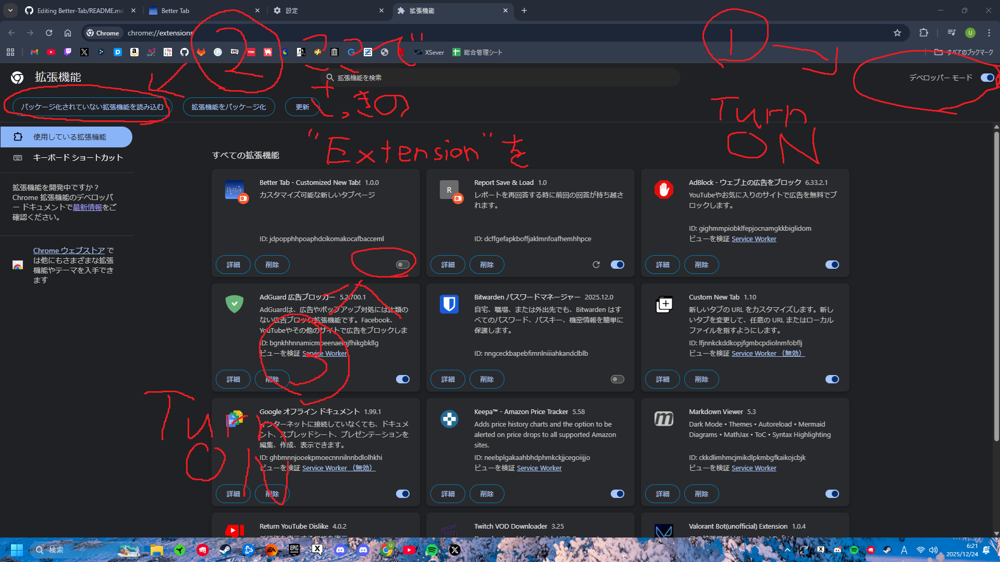

<div align="center">
  <h1>Better Tab</h1>
  
  <p>
    カスタマイズ可能な新しいタブページ。<br />
    時計、天気、カレンダー、トレンド記事を一つのページに集約した、<br />
    モダンで使いやすい新しいタブ用のページです。
  </p>
</div>


## 使用方法

#### 拡張機能
1. Releaseからzipをダウンロードする
2. ダウンロードしたzipを展開する
3. chrome://extensions/ を開く
4. デベロッパーモードを有効にする
5. パッケージ化されていない拡張機能を読み込むを押す
6. 先ほどの展開したzipの中のextensionを選択



#### もしくは
1. [Custom New Tab](https://chromewebstore.google.com/detail/custom-new-tab/lfjnnkckddkopjfgmbcpdiolnmfobflj?hl=ja&utm_source=ext_sidebar) 拡張機能をインストール
2. Custom New Tabの設定を開く
3. urlをペーストしてセーブ


### 機能の使い方
1. **背景画像の設定**
   - 設定アイコンをクリック
   - 「背景」タブを選択
   - 画像をアップロードするか、URLを入力
   - 必要に応じて画像をクロップ

2. **ウィジェットの表示/非表示**
   - 設定アイコンをクリック
   - 「表示設定」タブを選択
   - 各ウィジェットの表示/非表示を切り替え

3. **検索**
   - ページ中央の検索バーに検索語を入力
   - Enterキーを押すか検索ボタンをクリック

## 🛠️ 技術スタック

- **フレームワーク**: [Next.js](https://nextjs.org/) 16
- **UIライブラリ**: [React](https://react.dev/) 19
- **言語**: [TypeScript](https://www.typescriptlang.org/)
- **スタイリング**: [Tailwind CSS](https://tailwindcss.com/) 4
- **UIコンポーネント**: [Radix UI](https://www.radix-ui.com/)
- **データ保存**: IndexedDB
- **フォント**: [Geist](https://vercel.com/font)

## 📦 主要な依存関係

- `next`: Next.jsフレームワーク
- `react` / `react-dom`: Reactライブラリ
- `@radix-ui/react-dialog`: ダイアログコンポーネント
- `@radix-ui/react-slot`: スロットコンポーネント
- `lucide-react`: アイコンライブラリ
- `next-themes`: テーマ管理
- `react-easy-crop`: 画像クロップ機能
- `tailwindcss`: CSSフレームワーク

## 🌐 API

このプロジェクトは以下のAPIを使用しています：

- **気象庁API**: 天気予報と警報・注意報
- **OpenStreetMap Nominatim API**: 位置情報から市名を取得
- **holidays-jp.github.io API**: 日本の祝日情報
- **Qiita API**: トレンド記事

## 📁 プロジェクト構造

```
src/
├── app/
│   ├── api/          # APIルート
│   │   ├── weather/  # 天気情報API
│   │   ├── holidays/ # 祝日情報API
│   │   └── trending/ # トレンド記事API
│   ├── layout.tsx    # ルートレイアウト
│   ├── page.tsx      # ホームページ
│   └── globals.css   # グローバルスタイル
├── components/       # Reactコンポーネント
│   ├── calendar.tsx  # カレンダーコンポーネント
│   ├── clock.tsx     # 時計コンポーネント
│   ├── trending-articles.tsx # トレンド記事コンポーネント
│   └── ui/           # UIコンポーネント
├── hooks/            # カスタムフック
│   ├── useAppSettings.ts    # アプリ設定管理
│   └── useBackgroundImages.ts # 背景画像管理
└── lib/              # ユーティリティ
    ├── indexeddb-utils.ts   # IndexedDB操作
    ├── image-utils.ts        # 画像処理
    └── utils.ts              # 汎用ユーティリティ
```

## 📝 ライセンス

このプロジェクトは [Apache License 2.0](LICENSE) の下で公開されています。
